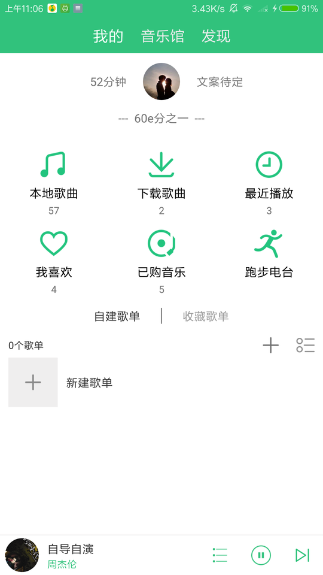
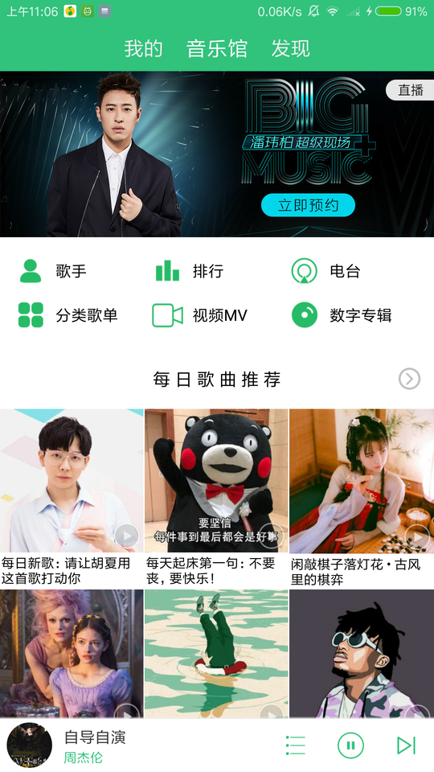
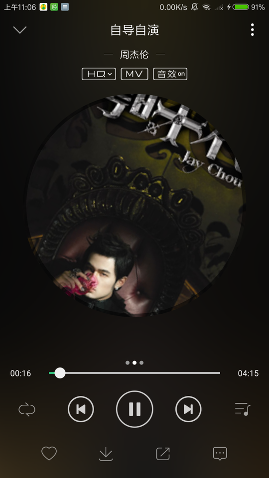
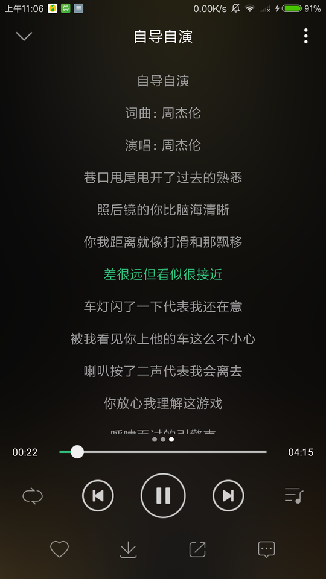
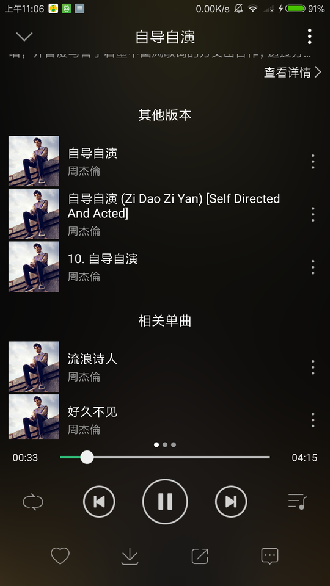
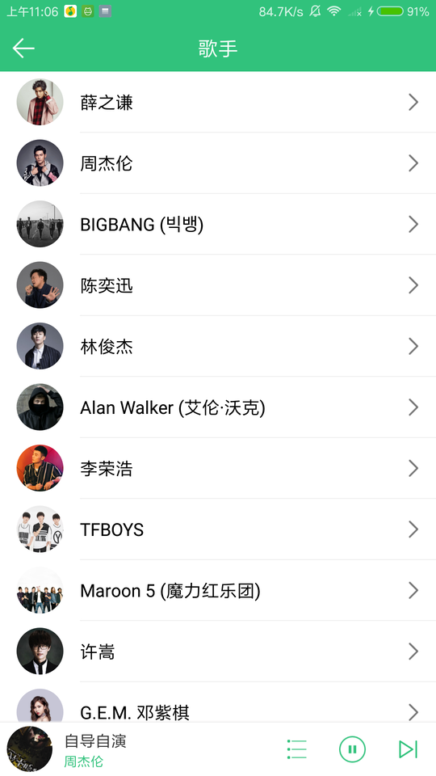

# SEMusic
仿QQ音乐

## 你可能对这个项目感兴趣的点

### Android
- 单Activity 多Fragment的APP结构
- MVP的架构模式
- Android音乐播放
- Android Service的使用
- Hook GsonConverter数据解析的流程
- Fragment的切换动画
- Android Loader的使用
  - 自定义ContentProvider配合Loader读取本地数据库
  - Retrofit配合Loader的使用，省去网络请求对生命周期的判断
- 进程间通信
  - AIDL的使用
  - 广播的使用

### Kotlin
- Kotlin反射的使用
- Kotlin对Null的处理（个人理解）
- kotlin拓展函数
---
 

 

 
